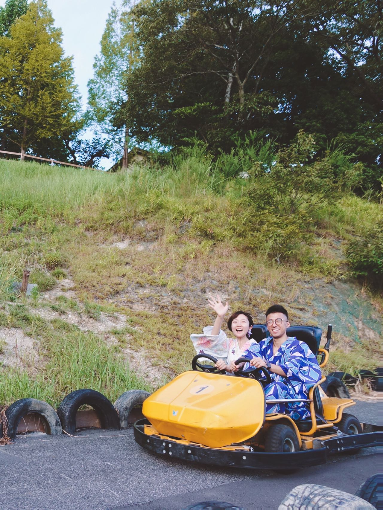

# About Me

<!--author-->

## Background
1. this list will be replaced by the toc
{:toc .large-only}

:-------------------------:|:-------------------------:
 |  **Toyota Motor North America, InfoTech Labs**   Mountain View, CA   Dec. 2020 - Present   *Research Scientist* 
 |  **Toyota Motor North America, InfoTech Labs**   Mountain View, CA   Jan. 2020 - May. 2020   *Research Intern* 
 |  **University of North Carolina, Charlotte**   Charlotte, NC   Sep. 2015 - Oct. 2020   *Ph.D. in Electrical and Computer Engineering* 
 |  **Harbin Institute of Technology**   Harbin, China   Aug. 2010 - Jun. 2014   *B.S. in Control Science and Engineering* 
{:.stretch-table}

## Hobbies

### Travel

Life is about the adventures you take and the memories you make.

🚩 A small goal 🚩 explore 20% of the world with my family by 2030. 🌎

Travel map - explored **8.82%** of the world (updated by June 2022).
{:.figure}

[Georgia Aquarium](https://www.georgiaaquarium.org/) - Atlanta, GA.
{:.figure}

[Musée du Louvre](https://www.louvre.fr/zh-hans) - Paris, France.
{:.figure}

[Yosemite National Park](https://www.nps.gov/yose/index.htm) - CA.
{:.figure}

Kart racing and wearing of a traditional Japanese Kimono - Tokyo, Japan.
{:.figure}

### Noodles & Ramen

## Updated CV

