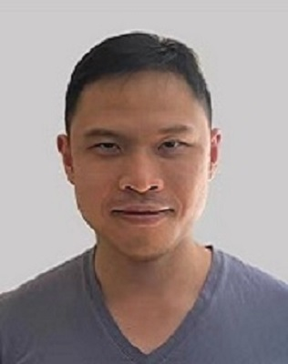
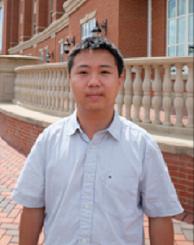

## Current Mentored Students 

### @Georgia State University

### Open Positions
**Dr. Wang's research lab is actively looking for high-motivated Ph.D. students.** [Details](/JD_GSU_PhD.pdf)

## Past Mentored Students 

### @InfoTech Labs, Toyota Motor North America

:-------------------------:|:-------------------------:
|  **Yitao Chen - 2022 Summer Co-op**   *Current status: Assistant Professor in AI and Advanced Computing School at Xi'an Jiaotong-Liverpool University in Suzhou, P. R. China*   Ph.D. advisor: Jiang (Linda) Xie   
|  **Siqi Huang - 2021 Summer Co-op**   Current status:   Ph.D. advisor:   
|  **Yuhan Kang - 2021 Spring Co-op**   Current status:   Ph.D. advisor:    
{:.stretch-table}
