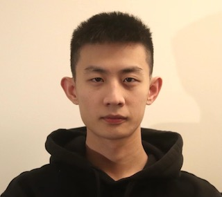
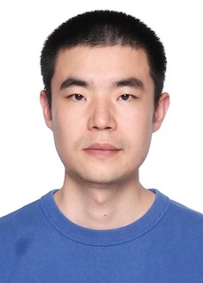

1. this list will be replaced by the toc
{:toc .large-only}

## Current Students 

### 📍 Georgia State University

   
- **Yueyang Liu**  
- Current status: Ph.D. student, Computer Science Department, Georgia State University  
- Research Interests: Computer Vision, Digital Twins, View Synthesis  

 
- **Hongyu Ke**   
- Current status: Ph.D. student, Computer Science Department, Georgia State University  
- Research Interests: Mobile AR/VR  

  
-**Xiaolong Tu**   
- Current status: Ph.D. student, Computer Science Department, Georgia State University  
- Research Interests: Sustainable AI, Carbon-Aware Computing Systems  

## Past Mentored Students 

### 📍 InfoTech Labs, Toyota Motor North America

:-------------------------:|:-------------------------:
|  **Yitao Chen - 2022 Summer Research Co-op**   ◾ Current status: Ph.D. student in the School of Computing and Augmented Intelligence at Arizona State University   ◾ Ph.D. advisor: [Ming Zhao](http://visa.lab.asu.edu/web/people/mingzhao/)  ◾ Research Interests: Federated learning, edge computing     <button style="background-color:#002993; border-color:#002993">[LINKEDIN](https://www.linkedin.com/in/yitao-chen-1725468a/)</button> <button style="background-color:#002993; border-color:#002993">[GOOGLE SCHOLAR](https://scholar.google.com/citations?user=95wMTD8AAAAJ&hl=en)</button>
 |  **Siqi Huang - 2021 Summer Research Co-op**   ◾ Current status: Assistant Professor in [AI and Advanced Computing School](https://www.xjtlu.edu.cn/en/study/departments/school-of-ai-and-advanced-computing/) at [Xi'an Jiaotong-Liverpool University](https://www.xjtlu.edu.cn/en/) in Suzhou, P. R. China   ◾ Ph.D. advisor: [Jiang (Linda) Xie](https://webpages.charlotte.edu/~jxie1/index.html)  ◾ Research Interests: Big data driven network design & optimization, cloud/edge computing, VR/AR, data mining, machine learning     <button style="background-color:#002993; border-color:#002993">[LINKEDIN](https://www.linkedin.com/in/siqi-huang-58546311b/)</button> <button style="background-color:#002993; border-color:#002993">[GOOGLE SCHOLAR](https://scholar.google.com/citations?user=vzx23bkAAAAJ&hl=en)</button>
|  **Yuhan Kang - 2021 Spring Research Co-op**   ◾ Current status: Ph.D. student in the Department of Electrical and Computer Engineering at the University of Houston   ◾ Ph.D. advisor: [Zhu Han](http://www2.egr.uh.edu/~zhan2/)   ◾ Research Interests: Game theory, mean-field games, mobile crowdsensing, edge computing     <button style="background-color:#002993; border-color:#002993">[LINKEDIN](https://www.linkedin.com/in/yuhan-kang-54496920a/)</button> <button style="background-color:#002993; border-color:#002993">[GOOGLE SCHOLAR](https://scholar.google.com/citations?user=9ovlDvQAAAAJ&hl=zh-CN)</button>
{:.stretch-table}
