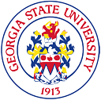
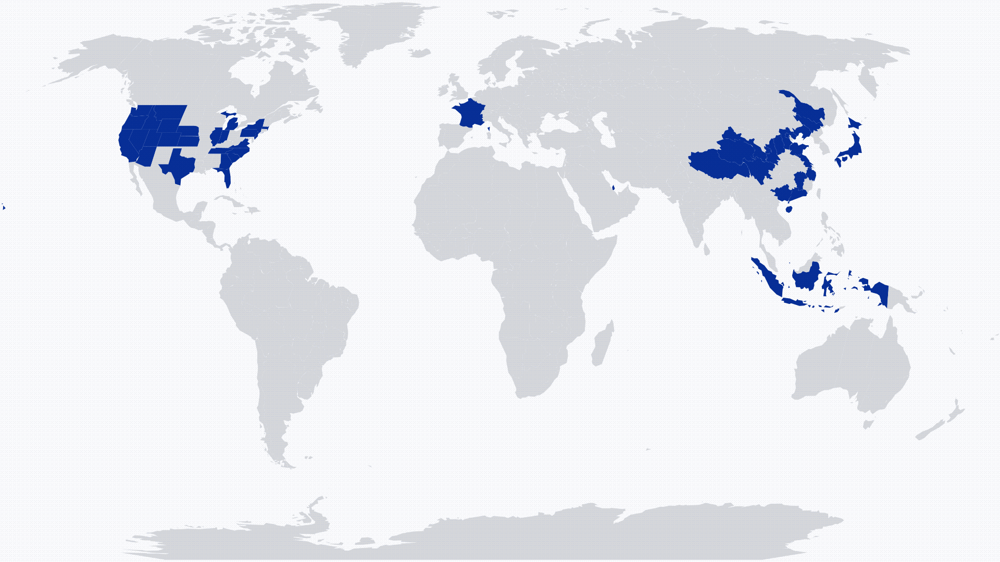
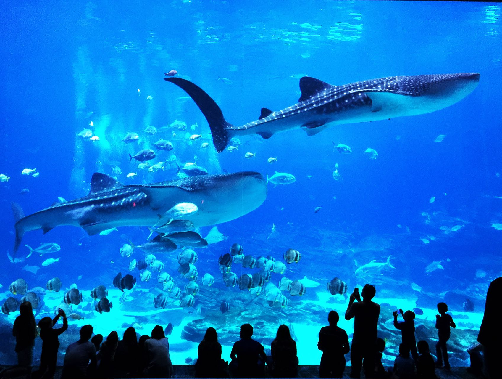
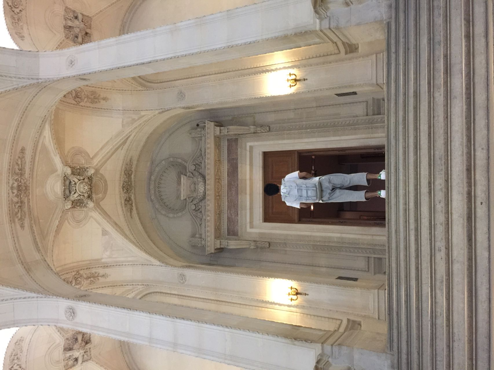
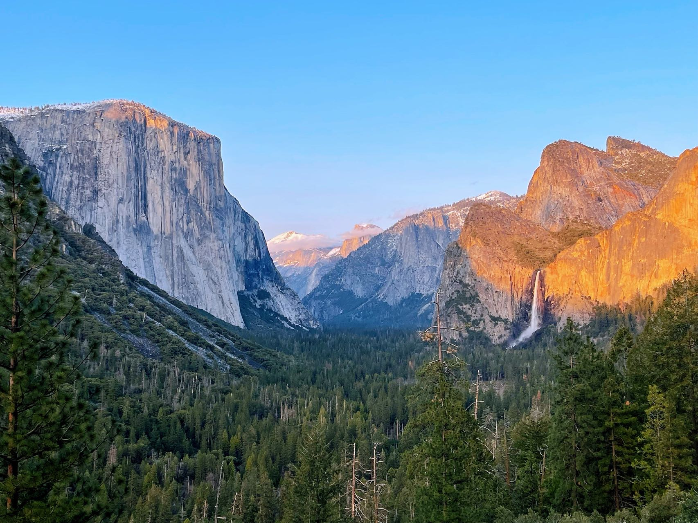
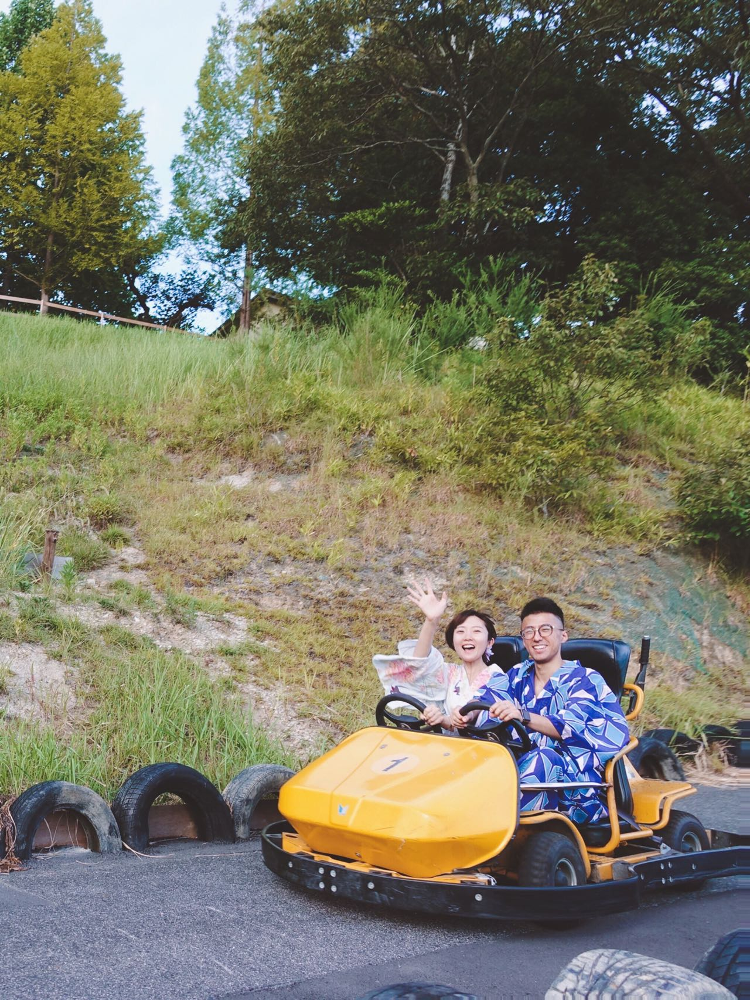
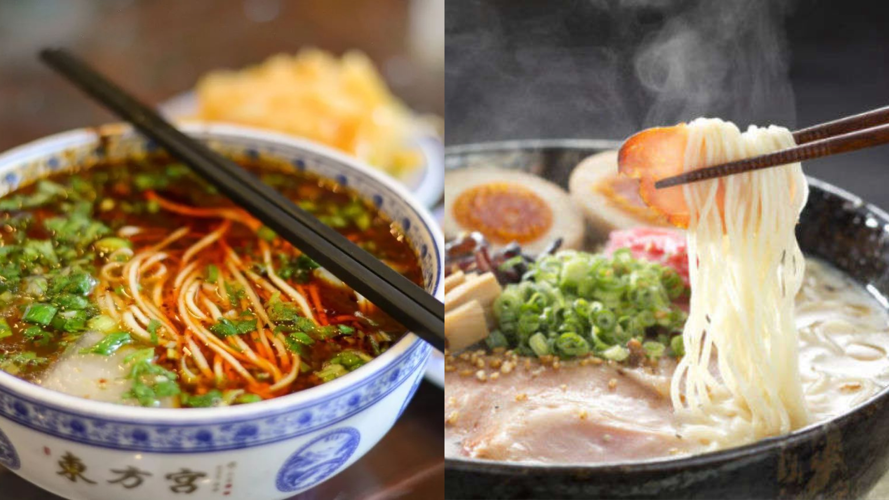

## About Me [CV](updated_CV.pdf)

<!--author-->

## News

## Background
1. this list will be replaced by the toc
{:toc .large-only}

:-------------------------:|:-------------------------:
 |  **Georgia State University, Computer Science Department**   Atlanta, GA   Aug. 2022 - Present   *Tenure-Track Assistant Professor* 
 |  **Toyota Motor North America, InfoTech Labs**   Mountain View, CA   Dec. 2020 - Aug. 2022   *Research Scientist* 
 |  **Toyota Motor North America, InfoTech Labs**   Mountain View, CA   Jan. 2020 - May. 2020   *Research Intern* 
 |  **University of North Carolina, Charlotte**   Charlotte, NC   Sep. 2015 - Oct. 2020   *Ph.D. in Electrical and Computer Engineering* 
 |  **Harbin Institute of Technology**   Harbin, China   Aug. 2010 - Jun. 2014   *B.S. in Control Science and Engineering* 
{:.stretch-table}

## Hobbies

### ✈️ Travel ✈️

Life is about the adventures you take and the memories you make.

🚩 A small goal 🚩 explore 20% of the world with my family 👪 by 2030. 🌎

Travel map - explored **8.82%** of the world (updated by June 2022).
{:.figure}

[Georgia Aquarium](https://www.georgiaaquarium.org/) - Atlanta, GA.
{:.figure}

[Musée du Louvre](https://www.louvre.fr/zh-hans) - Paris, France.
{:.figure}

[Yosemite National Park](https://www.nps.gov/yose/index.htm) - CA.
{:.figure}

Kart racing wearing a traditional Japanese Kimono - Tokyo, Japan.
{:.figure}

### 🍜 Noodles & Ramen 🍜

As a Lanzhou native, beef noodle is my "Soul Mate". I tried some Lanzhou noodle restaurants in the USA and Japan. I found some of them are authentic and would love to share with you if you want to give it a shot.

- 👍 馬子禄牛肉面 神保町店: 1 Chome-3-18 Kanda Jinbocho, Chiyoda City, Tokyo 101-0051, Japan
- 👍 Highland Noodles 金城兰州拉面: 1720 N Milpitas Blvd, Milpitas, CA 95035

I've started loving Ramen since I travelled in Japan. Also, it is much easier to find a good Japanese Ramen restaurant in the USA, especially in CA. Two of my best-loved Ramen restaurants:

- 👍 Ramen Hajime: 5229 Stevens Creek Blvd, Santa Clara, CA 95051
- 👍 Orenchi Ramen: 3540 Homestead Rd, Santa Clara, CA 95051

Left - Lanzhou beef noodles 🆚 Right - Japanese Ramen
{:.figure}

### To Be Continued ▶️

## Vistors

